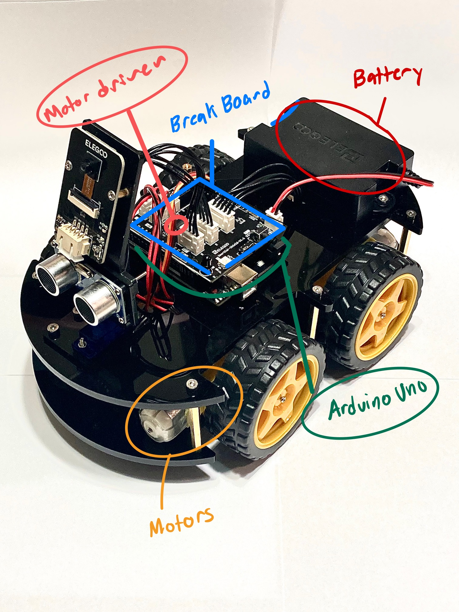

# Table Top Robot 
The Tabletop Robotis is a practical toolkit that has helped me improve a variety of skills. Additionally, it uses motors, sensors, and computers to interact intelligently with its environment. The robot is essential for beginning engineering and moving on to the next level. Furthermore, the tabletop robot detects the table's edge before realizing it will fall off and turning around to avoid it. This is the outcome of the following sources of information: The system includes an Arduino, a motor driver, DC motors, IR sensors, and ultrasonic sensors.

| **Engineer** | **School** | **Area of Interest** | **Grade** |
|:--:|:--:|:--:|:--:|
| Irwin C. | John H. Francis Polytechnic Senior High School | Electrical Engineering | Incoming Senior

<!--**Replace the BlueStamp logo below with an image of yourself and your completed project. Follow the guide [here](https://tomcam.github.io/least-github-pages/adding-images-github-pages-site.html) if you need help.**-->

<!---->
  
<!--# Final Milestone
For your final milestone, explain the outcome of your project. Key details to include are:
- What you've accomplished since your previous milestone
- What your biggest challenges and triumphs were at BSE
- A summary of key topics you learned about
- What you hope to learn in the future after everything you've learned at BSE-->

<!--**Don't forget to replace the text below with the embedding for your milestone video. Go to Youtube, click Share -> Embed, and copy
and paste the code to replace what's below.**-->

<!--<iframe width="560" height="315" src="https://www.youtube.com/embed/F7M7imOVGug" title="YouTube video player" frameborder="0" allow="accelerometer; autoplay; clipboard-write; encrypted-media; gyroscope; picture-in-picture; web-share" allowfullscreen></iframe>-->

# Second Milestone
In my second milestone, I built a piece of code from scratch that would aid me in the next step toward complete table top robot functioning. As a result, I used the sensor for line tracking, which allowed me to determine the sensor value and avoid the table's edge. Essentially, this sensor carries the pin number A0, which allows the sensor value to be appropriately analyzed to show whether the robot is on or off the table. When the sensor value detects that it is no longer on the table, my robot will stop, back up, turn, and continue onward. However, this is only a first step toward my eventual goal, therefore there will be several trials and errors along this process, such as coding. In the beginning coding was deffently difficult for me in the beginning, I had minimual knowlege, but BSE has helped me and I have a lot of them including having the correct sensor value to do my project correctly.

<!--**Don't forget to replace the text below with the embedding for your milestone video. Go to Youtube, click Share -> Embed, and copy
and paste the code to replace what's below.**-->

<iframe width="560" height="315" src="https://www.youtube.com/embed/8pPy4GfPHhc" title="YouTube video player" frameborder="0" allow="accelerometer; autoplay; clipboard-write; encrypted-media; gyroscope; picture-in-picture; web-share" allowfullscreen></iframe>

# First Milestone
Thanks to the motor driver, Arduino, and Arduino library, my robot can move for my first milestone.

The inputs are connected to the motors and act as a bridge, allowing both motors to function at the same time. This affects the robot's speed and direction of movement. Additionally, I connected an Arduino to the battery pack and the motor driver to help with the power transfer required for the robot to work. Furthermore, the robot has a microprocessor that I can configure to go in any direction or at any speed. 

Finally, I downloaded the Arduino library to the motor driver to supply me with the code to move the motors, then I tried it and ran into some difficulties, such as overloading the arduino with numerous outputs, but once I found the problem, I rectified it right away. My plan for the future is to finish the rest of my project and hopfully and modifcations. 



<iframe width="560" height="315" src="https://www.youtube.com/embed/4TMorQ3VmTU" title="YouTube video player" frameborder="0" allow="accelerometer; autoplay; clipboard-write; encrypted-media; gyroscope; picture-in-picture; web-share" allowfullscreen></iframe>

# Schematics 
<!--Here's where you'll put images of your schematics. [Tinkercad](https://www.tinkercad.com/blog/official-guide-to-tinkercad-circuits) and [Fritzing]( 14451_14450_sfe_motor_driver-dual_TB6612FNG_v11) 14451_14450_sfe_motor_driver-dual_TB6612FNG_v11.fzpz are both great resoruces to create professional schematic diagrams, though BSE recommends Tinkercad becuase it can be done easily and for free in the browser. -->

# Code
Here's where you'll put your code. The syntax below places it into a block of code. Follow the guide [here]([url](https://www.markdownguide.org/extended-syntax/)) to learn how to customize it to your project needs. 

```c++
#include <SparkFun_TB6612.h>
#include <IRremote.h>

// Motor pin definitions
const int PWMB = 6;
const int PWMA = 5;
const int AIN1 = 7;
const int BIN1 = 8;
const int BIN2 = 2;
const int STBY = 3;
const int AIN2 = 1;

// Analog input pin
const int analogInputPin = A1;

// ITR200001 chip pin
const int itrSensorPin = 4; 

// Maximum distance to detect an obstacle (in centimeters)
// const int maxDistance = 30; 
const int offsetA = 1;
const int offsetB = 1;

Motor motor1 = Motor(AIN1, AIN2, PWMA, offsetA, STBY);
Motor motor2 = Motor(BIN1, BIN2, PWMB, offsetB, STBY);

const int LEDPin = 13; 

void setup() {
  // Set motor control pins as outputs
  pinMode(PWMB, OUTPUT);
  pinMode(PWMA, OUTPUT);
  pinMode(AIN1, OUTPUT);
  pinMode(BIN1, OUTPUT);
  pinMode(BIN2, OUTPUT);
  pinMode(STBY, OUTPUT);
  pinMode(AIN2, OUTPUT);
  
  // Initialize serial communication
  Serial.begin(9600);
  pinMode(LEDPin, OUTPUT); 
}

void loop() {
  
  int sensorValue = analogRead(analogInputPin);
  const int threshold = 850; 
  Serial.println(sensorValue);
  
  if (sensorValue > threshold) {
    // Off the table
    digitalWrite(LEDPin, LOW); 
    brake(motor1, motor2);
    back(motor1, motor2, -150);
    delay(1000);
    left(motor1, motor2, 100);
    delay(1000);

  }
  
  if (sensorValue < threshold) {
    // On the table 
    digitalWrite(LEDPin, HIGH); 
    forward(motor1, motor2, 150);
  
  }
}
```

# Bill of Materials
Here's where you'll list the parts in your project. To add more rows, just copy and paste the example rows below.
Don't forget to place the link of where to buy each component inside the quotation marks in the corresponding row after href =. Follow the guide [here]([url](https://www.markdownguide.org/extended-syntax/)) to learn how to customize this to your project needs. 

| **Part** | **Note** | **Price** | **Link** |
|:--:|:--:|:--:|:--:|
| Arduino | To read inputs and change them into outputs | $28.50 | <a href="https://www.amazon.com/Arduino-A000066-ARDUINO-UNO-R3/dp/B008GRTSV6"> Link </a> |
|:--:|:--:|:--:|:--:|
|Line tracking Module  | Used for line following and edge detection | $11.98 | <a href="https://www.amazon.com/OSOYOO-5-Line-Tracking-Sensor-Female/dp/B091BRVBXD/ref=sr_1_2?crid=1L6IXN7JQAVR8&keywords=line+tracking+sensor+module&qid=1687830416&s=electronics&sprefix=line+tracking+sensor+module%2Celectronics%2C256&sr=1-2"> Link </a> |
|:--:|:--:|:--:|:--:|
| Ultrasonic Sensor | Can measure the distance to a wide range of objects regardless of shape, color or surface texture| $6.99 | <a href="https://www.amazon.com/CUQI-Ultrasonic-Measuring-Transmitter-Compatible/dp/B092D2DS1Y/ref=sr_1_3?crid=ANG1F83QMC03&keywords=Ultrasonic+sensor&qid=1687831203&s=electronics&sprefix=ultrasonic+senso%2Celectronics%2C193&sr=1-3"> Link </a> |
|:--:|:--:|:--:|:--:|
| Camera | recording images | $13.99 | <a href="https://www.amazon.com/Aokin-ESP32-CAM-Development-Bluetooth-Arduino/dp/B0C1V3R6SM/ref=sr_1_2?crid=1VMF6AUE9XNNN&keywords=camera+for+robot+TY-OV2640-12.7&qid=1687832917&s=electronics&sprefix=camera+for+robot+ty-ov2640-12.7%2Celectronics%2C235&sr=1-2"> Link </a> |
|:--:|:--:|:--:|:--:|
| DC Motors | Converts direct current electrical energy into mechanical energy | $5.28 | <a href="https://www.amazon.com/Yahboom-Motor-Leads-Shaft-248RPM/dp/B0BTHGG83F/ref=sr_1_13?keywords=DC+motors&qid=1687833562&sr=8-13"> Link </a> |
|:--:|:--:|:--:|:--:|
| Servos |control the position of objects, rotate objects, move legs, arms or hands of robots, move sensors | $10.99 | <a href="https://www.amazon.com/Maxmoral-Upgraded-Digital-Vehicle-Helicopter/dp/B07NV476P7/ref=d_pd_di_sccai_cn_sccl_2_6/136-6372419-2431801?pd_rd_w=rsun0&content-id=amzn1.sym.e13de93e-5518-4644-8e6b-4ee5f2e0b062&pf_rd_p=e13de93e-5518-4644-8e6b-4ee5f2e0b062&pf_rd_r=1JK02F0V52D7DJ56JSA0&pd_rd_wg=XuDbu&pd_rd_r=8767de95-190c-438c-b54f-a22aac2229ab&pd_rd_i=B07NV476P7&psc=1"> Link </a> |
|:--:|:--:|:--:|:--:|
| Lithuim Battery | To power robot | $16.99 | <a href="https://www.amazon.com/KBT-3-7V-1000mAh-Li-Polymer-Battery/dp/B0BJPFR756/ref=sr_1_2_sspa?crid=34OKC9CQ0OQIO&keywords=lithium+battery+5v&qid=1687843031&sprefix=lithium+battery+v%2Caps%2C387&sr=8-2-spons&sp_csd=d2lkZ2V0TmFtZT1zcF9hdGY&psc=1"> Link </a> |
|:--:|:--:|:--:|:--:|
| Item Name | What the item is used for | $Price | <a href="https://www.amazon.com/Arduino-A000066-ARDUINO-UNO-R3/dp/B008GRTSV6/"> Link </a> |
|:--:|:--:|:--:|:--:|
| Item Name | What the item is used for | $Price | <a href="https://www.amazon.com/Arduino-A000066-ARDUINO-UNO-R3/dp/B008GRTSV6/"> Link </a> |
|:--:|:--:|:--:|:--:|
| Item Name | What the item is used for | $Price | <a href="https://www.amazon.com/Arduino-A000066-ARDUINO-UNO-R3/dp/B008GRTSV6/"> Link </a> |
|:--:|:--:|:--:|:--:|


<!--# Other Resources/Examples
One of the best parts about Github is that you can view how other people set up their own work. Here are some past BSE portfolios that are awesome examples. You can view how they set up their portfolio, and you can view their index.md files to understand how they implemented different portfolio components.
- [Example 1](https://trashytuber.github.io/YimingJiaBlueStamp/)
- [Example 2](https://sviatil0.github.io/Sviatoslav_BSE/)
- [Example 3](https://arneshkumar.github.io/arneshbluestamp/)

To watch the BSE tutorial on how to create a portfolio, click here.-->
